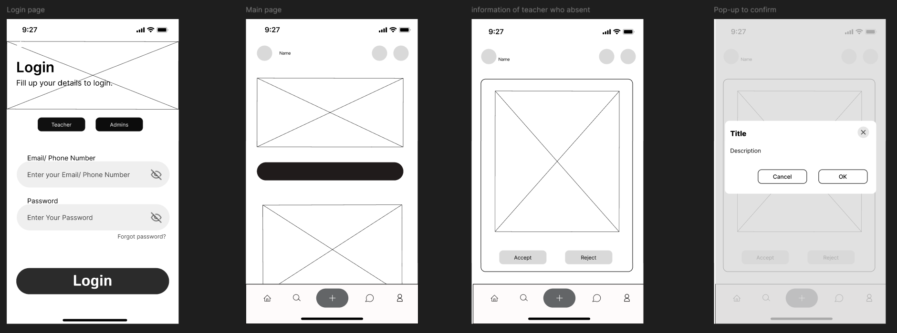
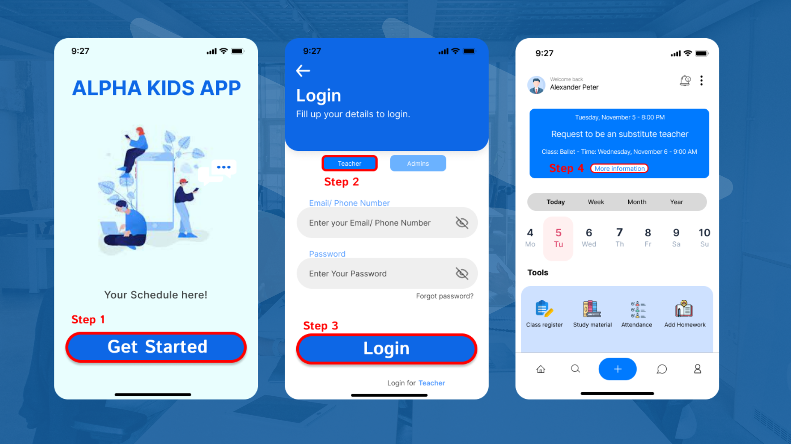
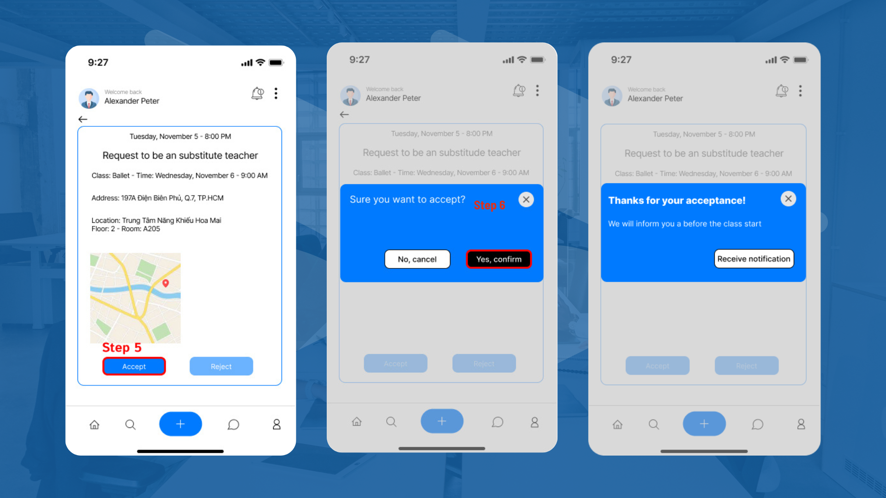
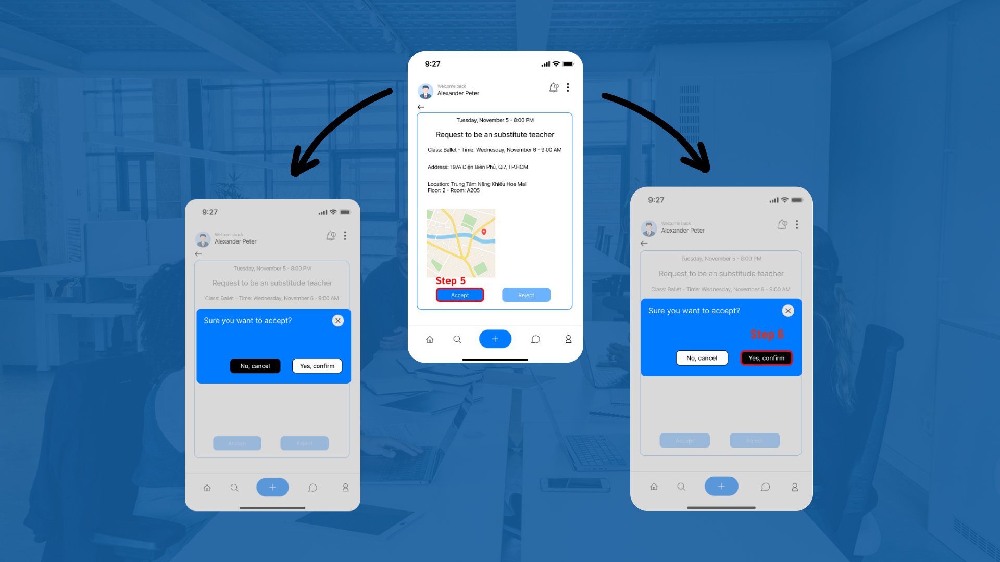
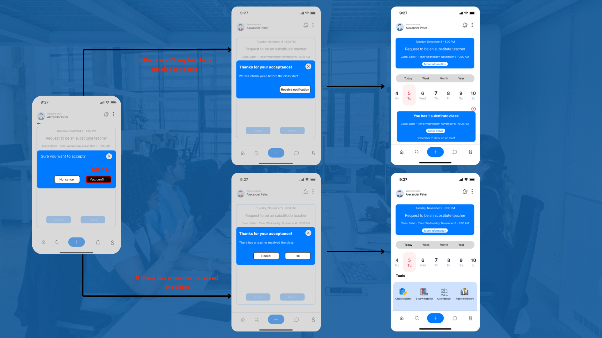

# Automated Teaching Schedule Management System 

## 1. Overview 
This simulated system was designed for Alpha Kids Talent Center – a company that provides teachers to kindergartens throughout Ho Chi Minh City. While providing a comprehensive management tool, the core solution centers on optimizing the emergency substitution process. By building an AI-integrated automation system, this project replaced the entirely manual scheduling process (Google Sheets + Zalo), enabling teacher replacements to be processed in less than 5 minutes.

---

## 2. Problem and Proposed Solution

| Problem | Solution |
| :--- | :--- |
| Finding a substitute teacher takes up to 1 hour manually | AI auto-suggests substitutes in < 5 minutes |
| Teacher data scattered, no centralization | Centralized database integrated with HR system |
| Last-minute changes cause class disruptions | Real-time push/SMS/email notifications |
| Manual scheduling prone to human errors | Automated scheduling with 95% error reduction target |

---

## 3. Key Features
* **AI-powered substitute teacher recommendation:** Filters by availability, qualifications, and proximity.
* **Automated notifications:** SMS, email, and in-app alerts sent instantly to teachers & admins.
* **Role-based access:** Customized workflows and interfaces for Teachers and Administrators.
* **HR system integration:** Real-time syncing of leave records, work history, and certifications.
* **Mobile app interface:** Teachers can conveniently accept or reject substitute requests on the go.

---

## 4. KPIs 

| Metric | Baseline | Target |
| :--- | :--- | :--- |
| Scheduling error rate | 10% | ↓ 95% reduction |
| Substitute response time | About 1 hour | < 5 minutes |
| Teacher availability updates | Manual | Real-time automated |

---

## 5. System Analysis Artifacts
*Below are the detailed analysis documents for the system:*

* [BPMN diagrams](diagrams/BPMN)
* [Class diagram](diagrams/Class%20diagram)
* [Sequence disgrams](diagrams/Sequence)
* [Use case diagram](diagrams/Use%20case)

---

## 6. Mockups (figma)
### Wireframe

### Preview Interfaces

### System interface for HR

